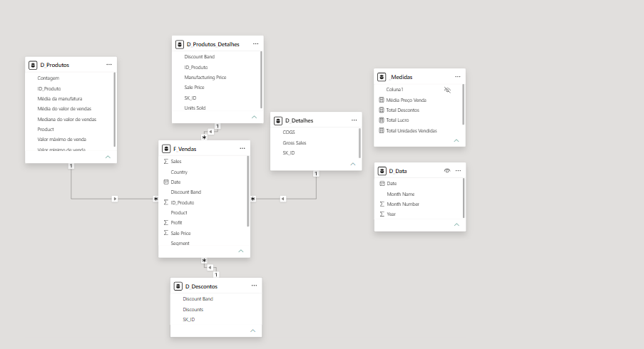

#  Financial Data Analysis Dashboard - Power BI

##  Descrição do Projeto
Este projeto consiste na construção de um dashboard financeiro interativo desenvolvido em Power BI, utilizando modelagem de dados no formato **Star Schema** (Esquema em Estrela) e cálculos personalizados em **DAX**.

O objetivo é fornecer uma visão executiva clara sobre o desempenho de vendas, lucros, descontos e volume de unidades vendidas ao longo do tempo, por produto e por localização geográfica.

---

##  Modelagem de Dados (Star Schema)
A estrutura foi modelada dividindo a base de dados original em tabelas de dimensão e uma tabela facto:
* **F_Vendas** (Tabela Facto): Contém o histórico de transações e métricas numéricas.
* **D_Data** (Dimensão): Tabela de calendário para inteligência temporal.
* **D_Produtos** & **D_Produtos_Detalhes** (Dimensão): Informações do catálogo de produtos.
* **D_Detalhes** & **D_Descontos** (Dimensão): Segmentação e faixas de desconto.

---

##  Medidas DAX Criadas
Para garantir a performance do relatório, centralizamos os cálculos na tabela `_Medidas`:
* **Total Vendas**: `Total Vendas = SUM(F_Vendas[Sales])`
* **Total Lucro**: `Total Lucro = SUM(F_Vendas[Profit])`
* **Total Descontos**: `Total Descontos = SUM(F_Vendas[Discounts])`
* **Total Unidades Vendidas**: `Total Unidades Vendidas = SUM(F_Vendas[Units Sold])`
* **Média Preço Venda**: `Média Preço Venda = AVERAGE(F_Vendas[Sale Price])`

---

##  Visualização do Dashboard

### Dashboard Final

### Modelo de Dados (Star Schema)

### Painel de Medidas DAX

---

## 🛠 Tecnologias Utilizadas
* **Power BI Desktop**
* **DAX (Data Analysis Expressions)**
* **Power Query / M** (Tratamento e ETL)
* **Star Schema Modeling**
